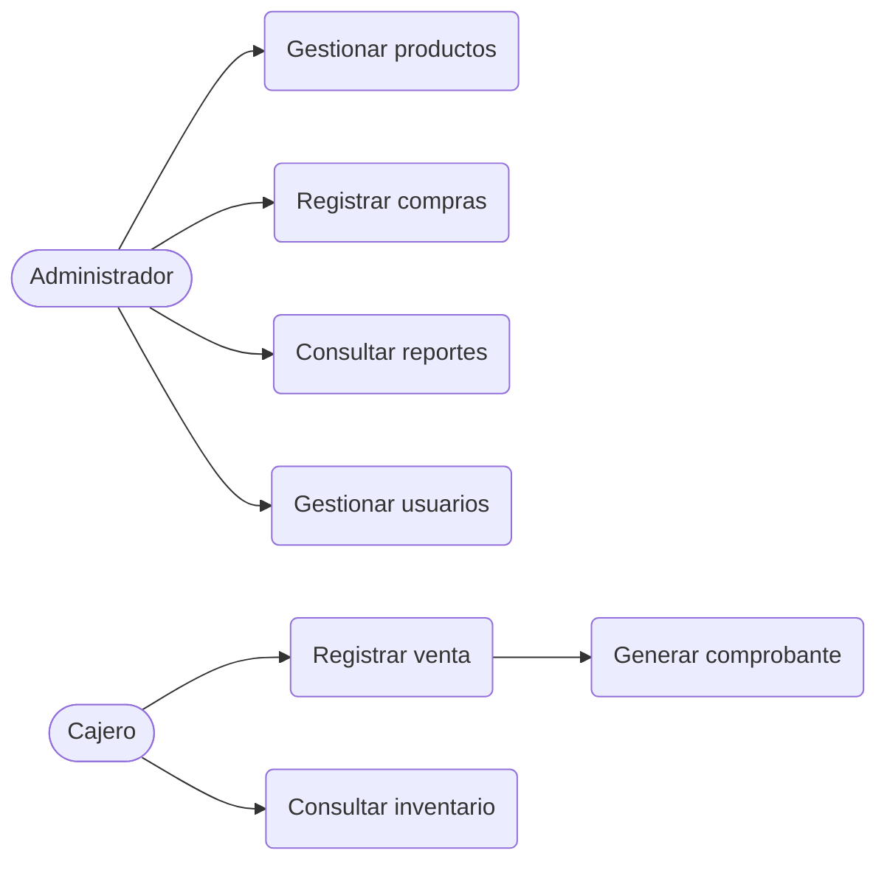
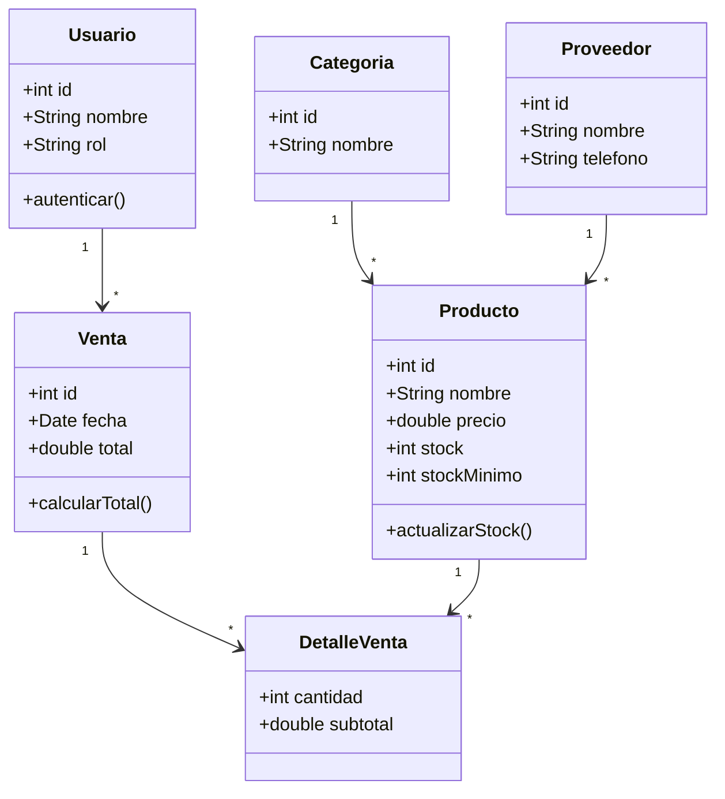
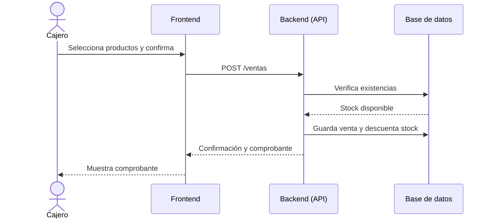

# Modelos UML

## Diagrama de casos de uso

```mermaid
flowchart LR
    A([Administrador])
    C([Cajero])
    A --> U1(Gestionar productos)
    A --> U2(Registrar compras)
    A --> U3(Consultar reportes)
    A --> U4(Gestionar usuarios)
    C --> U5(Registrar venta)
    C --> U6(Consultar inventario)
    U5 --> U7(Generar comprobante)
```

## Diagrama de clases

```mermaid
classDiagram
    class Producto {
        +int id
        +String nombre
        +double precio
        +int stock
        +int stockMinimo
        +actualizarStock()
    }
    class Categoria {
        +int id
        +String nombre
    }
    class Proveedor {
        +int id
        +String nombre
        +String telefono
    }
    class Venta {
        +int id
        +Date fecha
        +double total
        +calcularTotal()
    }
    class DetalleVenta {
        +int cantidad
        +double subtotal
    }
    class Usuario {
        +int id
        +String nombre
        +String rol
        +autenticar()
    }
    Categoria "1" --> "*" Producto
    Proveedor "1" --> "*" Producto
    Venta "1" --> "*" DetalleVenta
    Producto "1" --> "*" DetalleVenta
    Usuario "1" --> "*" Venta
```

## Diagrama de secuencia: registrar una venta

```mermaid
sequenceDiagram
    actor Cajero
    participant Frontend
    participant API as Backend (API)
    participant BD as Base de datos
    Cajero->>Frontend: Selecciona productos y confirma
    Frontend->>API: POST /ventas
    API->>BD: Verifica existencias
    BD-->>API: Stock disponible
    API->>BD: Guarda venta y descuenta stock
    API-->>Frontend: Confirmación y comprobante
    Frontend-->>Cajero: Muestra comprobante
```
